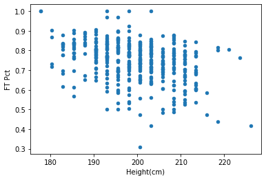

# Import Dependencies

```python
import pandas as pd
```

# Load Data

```python
df = pd.read_csv('nbaPlayers.csv')

df
```

<div>
<table border="1" class="dataframe">
  <thead>
    <tr style="text-align: right;">
      <th></th>
      <th>Player</th>
      <th>From</th>
      <th>To</th>
      <th>Pos</th>
      <th>Ht</th>
      <th>Wt</th>
      <th>Birth Date</th>
      <th>Colleges</th>
    </tr>
  </thead>
  <tbody>
    <tr>
      <th>0</th>
      <td>Alaa Abdelnaby|abdelal01</td>
      <td>1991</td>
      <td>1995</td>
      <td>F-C</td>
      <td>6-10</td>
      <td>240.0</td>
      <td>June 24 1968</td>
      <td>Duke</td>
    </tr>
    <tr>
      <th>1</th>
      <td>Zaid Abdul-Aziz|abdulza01</td>
      <td>1969</td>
      <td>1978</td>
      <td>C-F</td>
      <td>6-9</td>
      <td>235.0</td>
      <td>April 7 1946</td>
      <td>Iowa State</td>
    </tr>
    <tr>
      <th>2</th>
      <td>Kareem Abdul-Jabbar*|abdulka01</td>
      <td>1970</td>
      <td>1989</td>
      <td>C</td>
      <td>7-2</td>
      <td>225.0</td>
      <td>April 16 1947</td>
      <td>UCLA</td>
    </tr>
    <tr>
      <th>3</th>
      <td>Mahmoud Abdul-Rauf|abdulma02</td>
      <td>1991</td>
      <td>2001</td>
      <td>G</td>
      <td>6-1</td>
      <td>162.0</td>
      <td>March 9 1969</td>
      <td>LSU</td>
    </tr>
    <tr>
      <th>4</th>
      <td>Tariq Abdul-Wahad|abdulta01</td>
      <td>1998</td>
      <td>2003</td>
      <td>F</td>
      <td>6-6</td>
      <td>223.0</td>
      <td>November 3 1974</td>
      <td>Michigan San Jose State</td>
    </tr>
    <tr>
      <th>...</th>
      <td>...</td>
      <td>...</td>
      <td>...</td>
      <td>...</td>
      <td>...</td>
      <td>...</td>
      <td>...</td>
      <td>...</td>
    </tr>
    <tr>
      <th>4873</th>
      <td>Ante Žižić|zizican01</td>
      <td>2018</td>
      <td>2020</td>
      <td>F-C</td>
      <td>6-10</td>
      <td>266.0</td>
      <td>January 4 1997</td>
      <td>NaN</td>
    </tr>
    <tr>
      <th>4874</th>
      <td>Jim Zoet|zoetji01</td>
      <td>1983</td>
      <td>1983</td>
      <td>C</td>
      <td>7-1</td>
      <td>240.0</td>
      <td>December 20 1953</td>
      <td>Kent State University</td>
    </tr>
    <tr>
      <th>4875</th>
      <td>Bill Zopf|zopfbi01</td>
      <td>1971</td>
      <td>1971</td>
      <td>G</td>
      <td>6-1</td>
      <td>170.0</td>
      <td>June 7 1948</td>
      <td>Duquesne</td>
    </tr>
    <tr>
      <th>4876</th>
      <td>Ivica Zubac|zubaciv01</td>
      <td>2017</td>
      <td>2021</td>
      <td>C</td>
      <td>7-0</td>
      <td>240.0</td>
      <td>March 18 1997</td>
      <td>NaN</td>
    </tr>
    <tr>
      <th>4877</th>
      <td>Matt Zunic|zunicma01</td>
      <td>1949</td>
      <td>1949</td>
      <td>G-F</td>
      <td>6-3</td>
      <td>195.0</td>
      <td>December 19 1919</td>
      <td>George Washington</td>
    </tr>
  </tbody>
</table>
<p>4878 rows × 8 columns</p>
</div>

# Preprocess Data

```python
# Get number of years played as new column
df['Years Played'] = df.apply(lambda row: row.To - row.From, axis=1)

# Convert height from Feet to CM
def convertHeight(row):
    height_in_feet = row['Ht']
    height_in_cm = ((float(height_in_feet[0]) * 12) + float(height_in_feet[2:])) * 2.54
    return height_in_cm

df['Height(cm)'] = df.apply(lambda row: convertHeight(row), axis=1)

df
```

<div>
<table border="1" class="dataframe">
  <thead>
    <tr style="text-align: right;">
      <th></th>
      <th>Player</th>
      <th>From</th>
      <th>To</th>
      <th>Pos</th>
      <th>Ht</th>
      <th>Wt</th>
      <th>Birth Date</th>
      <th>Colleges</th>
      <th>Years Played</th>
      <th>Height(cm)</th>
    </tr>
  </thead>
  <tbody>
    <tr>
      <th>0</th>
      <td>Alaa Abdelnaby|abdelal01</td>
      <td>1991</td>
      <td>1995</td>
      <td>F-C</td>
      <td>6-10</td>
      <td>240.0</td>
      <td>June 24 1968</td>
      <td>Duke</td>
      <td>4</td>
      <td>208.28</td>
    </tr>
    <tr>
      <th>1</th>
      <td>Zaid Abdul-Aziz|abdulza01</td>
      <td>1969</td>
      <td>1978</td>
      <td>C-F</td>
      <td>6-9</td>
      <td>235.0</td>
      <td>April 7 1946</td>
      <td>Iowa State</td>
      <td>9</td>
      <td>205.74</td>
    </tr>
    <tr>
      <th>2</th>
      <td>Kareem Abdul-Jabbar*|abdulka01</td>
      <td>1970</td>
      <td>1989</td>
      <td>C</td>
      <td>7-2</td>
      <td>225.0</td>
      <td>April 16 1947</td>
      <td>UCLA</td>
      <td>19</td>
      <td>218.44</td>
    </tr>
    <tr>
      <th>3</th>
      <td>Mahmoud Abdul-Rauf|abdulma02</td>
      <td>1991</td>
      <td>2001</td>
      <td>G</td>
      <td>6-1</td>
      <td>162.0</td>
      <td>March 9 1969</td>
      <td>LSU</td>
      <td>10</td>
      <td>185.42</td>
    </tr>
    <tr>
      <th>4</th>
      <td>Tariq Abdul-Wahad|abdulta01</td>
      <td>1998</td>
      <td>2003</td>
      <td>F</td>
      <td>6-6</td>
      <td>223.0</td>
      <td>November 3 1974</td>
      <td>Michigan San Jose State</td>
      <td>5</td>
      <td>198.12</td>
    </tr>
    <tr>
      <th>...</th>
      <td>...</td>
      <td>...</td>
      <td>...</td>
      <td>...</td>
      <td>...</td>
      <td>...</td>
      <td>...</td>
      <td>...</td>
      <td>...</td>
      <td>...</td>
    </tr>
    <tr>
      <th>4873</th>
      <td>Ante Žižić|zizican01</td>
      <td>2018</td>
      <td>2020</td>
      <td>F-C</td>
      <td>6-10</td>
      <td>266.0</td>
      <td>January 4 1997</td>
      <td>NaN</td>
      <td>2</td>
      <td>208.28</td>
    </tr>
    <tr>
      <th>4874</th>
      <td>Jim Zoet|zoetji01</td>
      <td>1983</td>
      <td>1983</td>
      <td>C</td>
      <td>7-1</td>
      <td>240.0</td>
      <td>December 20 1953</td>
      <td>Kent State University</td>
      <td>0</td>
      <td>215.90</td>
    </tr>
    <tr>
      <th>4875</th>
      <td>Bill Zopf|zopfbi01</td>
      <td>1971</td>
      <td>1971</td>
      <td>G</td>
      <td>6-1</td>
      <td>170.0</td>
      <td>June 7 1948</td>
      <td>Duquesne</td>
      <td>0</td>
      <td>185.42</td>
    </tr>
    <tr>
      <th>4876</th>
      <td>Ivica Zubac|zubaciv01</td>
      <td>2017</td>
      <td>2021</td>
      <td>C</td>
      <td>7-0</td>
      <td>240.0</td>
      <td>March 18 1997</td>
      <td>NaN</td>
      <td>4</td>
      <td>213.36</td>
    </tr>
    <tr>
      <th>4877</th>
      <td>Matt Zunic|zunicma01</td>
      <td>1949</td>
      <td>1949</td>
      <td>G-F</td>
      <td>6-3</td>
      <td>195.0</td>
      <td>December 19 1919</td>
      <td>George Washington</td>
      <td>0</td>
      <td>190.50</td>
    </tr>
  </tbody>
</table>
<p>4878 rows × 10 columns</p>
</div>

```python
# Get active players
active_players_df = df[df['To'] == 2021]

active_players_df
```

<div>
<table border="1" class="dataframe">
  <thead>
    <tr style="text-align: right;">
      <th></th>
      <th>Player</th>
      <th>From</th>
      <th>To</th>
      <th>Pos</th>
      <th>Ht</th>
      <th>Wt</th>
      <th>Birth Date</th>
      <th>Colleges</th>
      <th>Years Played</th>
      <th>Height(cm)</th>
    </tr>
  </thead>
  <tbody>
    <tr>
      <th>10</th>
      <td>Precious Achiuwa|achiupr01</td>
      <td>2021</td>
      <td>2021</td>
      <td>F</td>
      <td>6-8</td>
      <td>225.0</td>
      <td>September 19 1999</td>
      <td>Memphis</td>
      <td>0</td>
      <td>203.20</td>
    </tr>
    <tr>
      <th>20</th>
      <td>Jaylen Adams|adamsja01</td>
      <td>2019</td>
      <td>2021</td>
      <td>G</td>
      <td>6-0</td>
      <td>225.0</td>
      <td>May 4 1996</td>
      <td>St. Bonaventure</td>
      <td>2</td>
      <td>182.88</td>
    </tr>
    <tr>
      <th>23</th>
      <td>Steven Adams|adamsst01</td>
      <td>2014</td>
      <td>2021</td>
      <td>C</td>
      <td>6-11</td>
      <td>265.0</td>
      <td>July 20 1993</td>
      <td>Pitt</td>
      <td>7</td>
      <td>210.82</td>
    </tr>
    <tr>
      <th>25</th>
      <td>Bam Adebayo|adebaba01</td>
      <td>2018</td>
      <td>2021</td>
      <td>C-F</td>
      <td>6-9</td>
      <td>255.0</td>
      <td>July 18 1997</td>
      <td>Kentucky</td>
      <td>3</td>
      <td>205.74</td>
    </tr>
    <tr>
      <th>44</th>
      <td>LaMarcus Aldridge|aldrila01</td>
      <td>2007</td>
      <td>2021</td>
      <td>F-C</td>
      <td>6-11</td>
      <td>250.0</td>
      <td>July 19 1985</td>
      <td>Texas</td>
      <td>14</td>
      <td>210.82</td>
    </tr>
    <tr>
      <th>...</th>
      <td>...</td>
      <td>...</td>
      <td>...</td>
      <td>...</td>
      <td>...</td>
      <td>...</td>
      <td>...</td>
      <td>...</td>
      <td>...</td>
      <td>...</td>
    </tr>
    <tr>
      <th>4823</th>
      <td>Delon Wright|wrighde01</td>
      <td>2016</td>
      <td>2021</td>
      <td>G</td>
      <td>6-5</td>
      <td>185.0</td>
      <td>April 26 1992</td>
      <td>Utah</td>
      <td>5</td>
      <td>195.58</td>
    </tr>
    <tr>
      <th>4854</th>
      <td>Thaddeus Young|youngth01</td>
      <td>2008</td>
      <td>2021</td>
      <td>F</td>
      <td>6-8</td>
      <td>235.0</td>
      <td>June 21 1988</td>
      <td>Georgia Tech</td>
      <td>13</td>
      <td>203.20</td>
    </tr>
    <tr>
      <th>4856</th>
      <td>Trae Young|youngtr01</td>
      <td>2019</td>
      <td>2021</td>
      <td>G</td>
      <td>6-1</td>
      <td>180.0</td>
      <td>September 19 1998</td>
      <td>Oklahoma</td>
      <td>2</td>
      <td>185.42</td>
    </tr>
    <tr>
      <th>4860</th>
      <td>Cody Zeller|zelleco01</td>
      <td>2014</td>
      <td>2021</td>
      <td>C-F</td>
      <td>6-11</td>
      <td>240.0</td>
      <td>October 5 1992</td>
      <td>Indiana</td>
      <td>7</td>
      <td>210.82</td>
    </tr>
    <tr>
      <th>4876</th>
      <td>Ivica Zubac|zubaciv01</td>
      <td>2017</td>
      <td>2021</td>
      <td>C</td>
      <td>7-0</td>
      <td>240.0</td>
      <td>March 18 1997</td>
      <td>NaN</td>
      <td>4</td>
      <td>213.36</td>
    </tr>
  </tbody>
</table>
<p>470 rows × 10 columns</p>
</div>

```python
# Get active players with at least 1 years experience
experienced_players = active_players_df[active_players_df['Years Played'] >= 1]

experienced_players
```

<div>
<table border="1" class="dataframe">
  <thead>
    <tr style="text-align: right;">
      <th></th>
      <th>Player</th>
      <th>From</th>
      <th>To</th>
      <th>Pos</th>
      <th>Ht</th>
      <th>Wt</th>
      <th>Birth Date</th>
      <th>Colleges</th>
      <th>Years Played</th>
      <th>Height(cm)</th>
    </tr>
  </thead>
  <tbody>
    <tr>
      <th>20</th>
      <td>Jaylen Adams|adamsja01</td>
      <td>2019</td>
      <td>2021</td>
      <td>G</td>
      <td>6-0</td>
      <td>225.0</td>
      <td>May 4 1996</td>
      <td>St. Bonaventure</td>
      <td>2</td>
      <td>182.88</td>
    </tr>
    <tr>
      <th>23</th>
      <td>Steven Adams|adamsst01</td>
      <td>2014</td>
      <td>2021</td>
      <td>C</td>
      <td>6-11</td>
      <td>265.0</td>
      <td>July 20 1993</td>
      <td>Pitt</td>
      <td>7</td>
      <td>210.82</td>
    </tr>
    <tr>
      <th>25</th>
      <td>Bam Adebayo|adebaba01</td>
      <td>2018</td>
      <td>2021</td>
      <td>C-F</td>
      <td>6-9</td>
      <td>255.0</td>
      <td>July 18 1997</td>
      <td>Kentucky</td>
      <td>3</td>
      <td>205.74</td>
    </tr>
    <tr>
      <th>44</th>
      <td>LaMarcus Aldridge|aldrila01</td>
      <td>2007</td>
      <td>2021</td>
      <td>F-C</td>
      <td>6-11</td>
      <td>250.0</td>
      <td>July 19 1985</td>
      <td>Texas</td>
      <td>14</td>
      <td>210.82</td>
    </tr>
    <tr>
      <th>54</th>
      <td>Nickeil Alexander-Walker|alexani01</td>
      <td>2020</td>
      <td>2021</td>
      <td>G</td>
      <td>6-6</td>
      <td>205.0</td>
      <td>September 2 1998</td>
      <td>Virginia Tech</td>
      <td>1</td>
      <td>198.12</td>
    </tr>
    <tr>
      <th>...</th>
      <td>...</td>
      <td>...</td>
      <td>...</td>
      <td>...</td>
      <td>...</td>
      <td>...</td>
      <td>...</td>
      <td>...</td>
      <td>...</td>
      <td>...</td>
    </tr>
    <tr>
      <th>4823</th>
      <td>Delon Wright|wrighde01</td>
      <td>2016</td>
      <td>2021</td>
      <td>G</td>
      <td>6-5</td>
      <td>185.0</td>
      <td>April 26 1992</td>
      <td>Utah</td>
      <td>5</td>
      <td>195.58</td>
    </tr>
    <tr>
      <th>4854</th>
      <td>Thaddeus Young|youngth01</td>
      <td>2008</td>
      <td>2021</td>
      <td>F</td>
      <td>6-8</td>
      <td>235.0</td>
      <td>June 21 1988</td>
      <td>Georgia Tech</td>
      <td>13</td>
      <td>203.20</td>
    </tr>
    <tr>
      <th>4856</th>
      <td>Trae Young|youngtr01</td>
      <td>2019</td>
      <td>2021</td>
      <td>G</td>
      <td>6-1</td>
      <td>180.0</td>
      <td>September 19 1998</td>
      <td>Oklahoma</td>
      <td>2</td>
      <td>185.42</td>
    </tr>
    <tr>
      <th>4860</th>
      <td>Cody Zeller|zelleco01</td>
      <td>2014</td>
      <td>2021</td>
      <td>C-F</td>
      <td>6-11</td>
      <td>240.0</td>
      <td>October 5 1992</td>
      <td>Indiana</td>
      <td>7</td>
      <td>210.82</td>
    </tr>
    <tr>
      <th>4876</th>
      <td>Ivica Zubac|zubaciv01</td>
      <td>2017</td>
      <td>2021</td>
      <td>C</td>
      <td>7-0</td>
      <td>240.0</td>
      <td>March 18 1997</td>
      <td>NaN</td>
      <td>4</td>
      <td>213.36</td>
    </tr>
  </tbody>
</table>
<p>395 rows × 10 columns</p>
</div>

```python
# Convert filtered players into a csv file
experienced_players.to_csv('filteredPlayers.csv')
```

```python
# Remove usernames of players
def remove_slugs(row):
    name = row['Player']
    name = name.split("|")[0]
    return name

experienced_players['Player'] = experienced_players.apply(lambda row: remove_slugs(row), axis=1)
experienced_players
```

# <<<<<<< HEAD

> > > > > > > a260399f2bee2ee78a7cbc7d47700eaa562f58a0

<div>
<table border="1" class="dataframe">
  <thead>
    <tr style="text-align: right;">
      <th></th>
      <th>Player</th>
      <th>From</th>
      <th>To</th>
      <th>Pos</th>
      <th>Ht</th>
      <th>Wt</th>
      <th>Birth Date</th>
      <th>Colleges</th>
      <th>Years Played</th>
      <th>Height(cm)</th>
    </tr>
  </thead>
  <tbody>
    <tr>
      <th>20</th>
      <td>Jaylen Adams</td>
      <td>2019</td>
      <td>2021</td>
      <td>G</td>
      <td>6-0</td>
      <td>225.0</td>
      <td>May 4 1996</td>
      <td>St. Bonaventure</td>
      <td>2</td>
      <td>182.88</td>
    </tr>
    <tr>
      <th>23</th>
      <td>Steven Adams</td>
      <td>2014</td>
      <td>2021</td>
      <td>C</td>
      <td>6-11</td>
      <td>265.0</td>
      <td>July 20 1993</td>
      <td>Pitt</td>
      <td>7</td>
      <td>210.82</td>
    </tr>
    <tr>
      <th>25</th>
      <td>Bam Adebayo</td>
      <td>2018</td>
      <td>2021</td>
      <td>C-F</td>
      <td>6-9</td>
      <td>255.0</td>
      <td>July 18 1997</td>
      <td>Kentucky</td>
      <td>3</td>
      <td>205.74</td>
    </tr>
    <tr>
      <th>44</th>
      <td>LaMarcus Aldridge</td>
      <td>2007</td>
      <td>2021</td>
      <td>F-C</td>
      <td>6-11</td>
      <td>250.0</td>
      <td>July 19 1985</td>
      <td>Texas</td>
      <td>14</td>
      <td>210.82</td>
    </tr>
    <tr>
      <th>54</th>
      <td>Nickeil Alexander-Walker</td>
      <td>2020</td>
      <td>2021</td>
      <td>G</td>
      <td>6-6</td>
      <td>205.0</td>
      <td>September 2 1998</td>
      <td>Virginia Tech</td>
      <td>1</td>
      <td>198.12</td>
    </tr>
    <tr>
      <th>...</th>
      <td>...</td>
      <td>...</td>
      <td>...</td>
      <td>...</td>
      <td>...</td>
      <td>...</td>
      <td>...</td>
      <td>...</td>
      <td>...</td>
      <td>...</td>
    </tr>
    <tr>
      <th>4823</th>
      <td>Delon Wright</td>
      <td>2016</td>
      <td>2021</td>
      <td>G</td>
      <td>6-5</td>
      <td>185.0</td>
      <td>April 26 1992</td>
      <td>Utah</td>
      <td>5</td>
      <td>195.58</td>
    </tr>
    <tr>
      <th>4854</th>
      <td>Thaddeus Young</td>
      <td>2008</td>
      <td>2021</td>
      <td>F</td>
      <td>6-8</td>
      <td>235.0</td>
      <td>June 21 1988</td>
      <td>Georgia Tech</td>
      <td>13</td>
      <td>203.20</td>
    </tr>
    <tr>
      <th>4856</th>
      <td>Trae Young</td>
      <td>2019</td>
      <td>2021</td>
      <td>G</td>
      <td>6-1</td>
      <td>180.0</td>
      <td>September 19 1998</td>
      <td>Oklahoma</td>
      <td>2</td>
      <td>185.42</td>
    </tr>
    <tr>
      <th>4860</th>
      <td>Cody Zeller</td>
      <td>2014</td>
      <td>2021</td>
      <td>C-F</td>
      <td>6-11</td>
      <td>240.0</td>
      <td>October 5 1992</td>
      <td>Indiana</td>
      <td>7</td>
      <td>210.82</td>
    </tr>
    <tr>
      <th>4876</th>
      <td>Ivica Zubac</td>
      <td>2017</td>
      <td>2021</td>
      <td>C</td>
      <td>7-0</td>
      <td>240.0</td>
      <td>March 18 1997</td>
      <td>NaN</td>
      <td>4</td>
      <td>213.36</td>
    </tr>
  </tbody>
</table>
<p>395 rows × 10 columns</p>
</div>

# Working with basketball-reference-scraper API

```python
from basketball_reference_scraper.players import get_stats
```

## Add Career Free Throw Pct to experienced_players Dataframe

##### The API used to collect the data was not able to get the Free Throw Percentage of all active and experienced players. Players that were left out were stored in a list. These players' Free Throw Percentage will be retrieved from the website (basketball-reference.com) and added manually.

```python
experienced_players.insert(10, 'FT Pct', 0)
```

```python
players_left = []

def get_avg_ft_pct(row):
    player = row['Player']
    ft_avg = 0
    try:
        player_stats = get_stats(player)
        ft_avg = player_stats['FT%'].mean()
    except:
        players_left.append(player)
        ft_avg = 'N/A'
    return ft_avg

experienced_players['FT Pct'] = experienced_players.apply(lambda row: get_avg_ft_pct(row), axis=1)
```

<div>
<table border="1" class="dataframe">
  <thead>
    <tr style="text-align: right;">
      <th></th>
      <th>Player</th>
      <th>From</th>
      <th>To</th>
      <th>Pos</th>
      <th>Ht</th>
      <th>Wt</th>
      <th>Birth Date</th>
      <th>Colleges</th>
      <th>Years Played</th>
      <th>Height(cm)</th>
      <th>FT Pct</th>
    </tr>
  </thead>
  <tbody>
    <tr>
      <th>20</th>
      <td>Jaylen Adams</td>
      <td>2019</td>
      <td>2021</td>
      <td>G</td>
      <td>6-0</td>
      <td>225.0</td>
      <td>May 4 1996</td>
      <td>St. Bonaventure</td>
      <td>2</td>
      <td>182.88</td>
      <td>0.778</td>
    </tr>
    <tr>
      <th>23</th>
      <td>Steven Adams</td>
      <td>2014</td>
      <td>2021</td>
      <td>C</td>
      <td>6-11</td>
      <td>265.0</td>
      <td>July 20 1993</td>
      <td>Pitt</td>
      <td>7</td>
      <td>210.82</td>
      <td>0.550625</td>
    </tr>
    <tr>
      <th>25</th>
      <td>Bam Adebayo</td>
      <td>2018</td>
      <td>2021</td>
      <td>C-F</td>
      <td>6-9</td>
      <td>255.0</td>
      <td>July 18 1997</td>
      <td>Kentucky</td>
      <td>3</td>
      <td>205.74</td>
      <td>0.75</td>
    </tr>
    <tr>
      <th>44</th>
      <td>LaMarcus Aldridge</td>
      <td>2007</td>
      <td>2021</td>
      <td>F-C</td>
      <td>6-11</td>
      <td>250.0</td>
      <td>July 19 1985</td>
      <td>Texas</td>
      <td>14</td>
      <td>210.82</td>
      <td>0.7994</td>
    </tr>
    <tr>
      <th>54</th>
      <td>Nickeil Alexander-Walker</td>
      <td>2020</td>
      <td>2021</td>
      <td>G</td>
      <td>6-6</td>
      <td>205.0</td>
      <td>September 2 1998</td>
      <td>Virginia Tech</td>
      <td>1</td>
      <td>198.12</td>
      <td>0.7295</td>
    </tr>
    <tr>
      <th>...</th>
      <td>...</td>
      <td>...</td>
      <td>...</td>
      <td>...</td>
      <td>...</td>
      <td>...</td>
      <td>...</td>
      <td>...</td>
      <td>...</td>
      <td>...</td>
      <td>...</td>
    </tr>
    <tr>
      <th>4823</th>
      <td>Delon Wright</td>
      <td>2016</td>
      <td>2021</td>
      <td>G</td>
      <td>6-5</td>
      <td>185.0</td>
      <td>April 26 1992</td>
      <td>Utah</td>
      <td>5</td>
      <td>195.58</td>
      <td>0.793375</td>
    </tr>
    <tr>
      <th>4854</th>
      <td>Thaddeus Young</td>
      <td>2008</td>
      <td>2021</td>
      <td>F</td>
      <td>6-8</td>
      <td>235.0</td>
      <td>June 21 1988</td>
      <td>Georgia Tech</td>
      <td>13</td>
      <td>203.20</td>
      <td>0.645875</td>
    </tr>
    <tr>
      <th>4856</th>
      <td>Trae Young</td>
      <td>2019</td>
      <td>2021</td>
      <td>G</td>
      <td>6-1</td>
      <td>180.0</td>
      <td>September 19 1998</td>
      <td>Oklahoma</td>
      <td>2</td>
      <td>185.42</td>
      <td>0.856333</td>
    </tr>
    <tr>
      <th>4860</th>
      <td>Cody Zeller</td>
      <td>2014</td>
      <td>2021</td>
      <td>C-F</td>
      <td>6-11</td>
      <td>240.0</td>
      <td>October 5 1992</td>
      <td>Indiana</td>
      <td>7</td>
      <td>210.82</td>
      <td>0.731375</td>
    </tr>
    <tr>
      <th>4876</th>
      <td>Ivica Zubac</td>
      <td>2017</td>
      <td>2021</td>
      <td>C</td>
      <td>7-0</td>
      <td>240.0</td>
      <td>March 18 1997</td>
      <td>NaN</td>
      <td>4</td>
      <td>213.36</td>
      <td>0.77</td>
    </tr>
  </tbody>
</table>
<p>395 rows × 11 columns</p>
</div>

```python
len(players_left)
```

    30

```python
players_left
```

    ['Marvin Bagley',
     'Mohamed Bamba',
     'Patrick Beverley',
     'Bojan Bogdanović',
     'Troy Brown',
     'Clint Capela',
     'Wendell Carter',
     'Joel Embiid',
     'Danilo Gallinari',
     'Marc Gasol',
     'Jeff Green',
     'Blake Griffin',
     'Tim Hardaway',
     'Serge Ibaka',
     'Derrick Jones',
     'Maxi Kleber',
     "E'Twaun Moore",
     'Frank Ntilikina',
     "Royce O'Neale",
     'Cedi Osman',
     'Kelly Oubre',
     'Michael Porter',
     'Derrick Rose',
     'Ricky Rubio',
     "D'Angelo Russell",
     'Ben Simmons',
     'Dennis Smith',
     'Garrett Temple',
     'P.J. Tucker',
     'Hassan Whiteside']

# Drop unneccessary columns

```python
columns_to_drop = ['From', 'To', 'Pos', 'Ht', 'Wt', 'Birth Date', 'Colleges']
required_data = experienced_players.drop(columns=columns_to_drop)
```

```python
required_data
```

<div>
<table border="1" class="dataframe">
  <thead>
    <tr style="text-align: right;">
      <th></th>
      <th>Player</th>
      <th>Years Played</th>
      <th>Height(cm)</th>
      <th>FT Pct</th>
    </tr>
  </thead>
  <tbody>
    <tr>
      <th>20</th>
      <td>Jaylen Adams</td>
      <td>2</td>
      <td>182.88</td>
      <td>0.778</td>
    </tr>
    <tr>
      <th>23</th>
      <td>Steven Adams</td>
      <td>7</td>
      <td>210.82</td>
      <td>0.550625</td>
    </tr>
    <tr>
      <th>25</th>
      <td>Bam Adebayo</td>
      <td>3</td>
      <td>205.74</td>
      <td>0.75</td>
    </tr>
    <tr>
      <th>44</th>
      <td>LaMarcus Aldridge</td>
      <td>14</td>
      <td>210.82</td>
      <td>0.7994</td>
    </tr>
    <tr>
      <th>54</th>
      <td>Nickeil Alexander-Walker</td>
      <td>1</td>
      <td>198.12</td>
      <td>0.7295</td>
    </tr>
    <tr>
      <th>...</th>
      <td>...</td>
      <td>...</td>
      <td>...</td>
      <td>...</td>
    </tr>
    <tr>
      <th>4823</th>
      <td>Delon Wright</td>
      <td>5</td>
      <td>195.58</td>
      <td>0.793375</td>
    </tr>
    <tr>
      <th>4854</th>
      <td>Thaddeus Young</td>
      <td>13</td>
      <td>203.20</td>
      <td>0.645875</td>
    </tr>
    <tr>
      <th>4856</th>
      <td>Trae Young</td>
      <td>2</td>
      <td>185.42</td>
      <td>0.856333</td>
    </tr>
    <tr>
      <th>4860</th>
      <td>Cody Zeller</td>
      <td>7</td>
      <td>210.82</td>
      <td>0.731375</td>
    </tr>
    <tr>
      <th>4876</th>
      <td>Ivica Zubac</td>
      <td>4</td>
      <td>213.36</td>
      <td>0.77</td>
    </tr>
  </tbody>
</table>
<p>395 rows × 4 columns</p>
</div>

# Generate graph

```python
# To add the free throw percentage data for the remaining players, the required data is saved into a CSV file and updated manually
# required_data.to_csv('requiredData.csv')
```

```python
# After updating the CSV file containing the required data, the modified CSV file is loaded to generate a graph and calculate correlation
data_df = pd.read_csv('requiredData.csv')
```

```python
ax1 = data_df.plot.scatter(x='Height(cm)', y='FT Pct')
```



# Calculating Pearson Product-Moment Correlation Coefficient

```python
# Get Covariance of both variables

height_and_ft_df = data_df.drop(columns=['Unnamed: 0', 'Player', 'Years Played'])

height_and_ft_df.cov()
```

<div>
<table border="1" class="dataframe">
  <thead>
    <tr style="text-align: right;">
      <th></th>
      <th>Height(cm)</th>
      <th>FT Pct</th>
    </tr>
  </thead>
  <tbody>
    <tr>
      <th>Height(cm)</th>
      <td>76.344942</td>
      <td>-0.315670</td>
    </tr>
    <tr>
      <th>FT Pct</th>
      <td>-0.315670</td>
      <td>0.010744</td>
    </tr>
  </tbody>
</table>
</div>

```python
# We know that the covariance of the two variables is -0.315670
covariance_x_y = -0.315670
```

```python
# Get standard deviation of each variable
height_and_ft_df.std()
```

    Height(cm)    8.737559
    FT Pct        0.103652
    dtype: float64

```python
standard_deviation_x = 8.737559
standard_deviation_y = 0.103652
```

```python
# Plug in calculated values into correlation formula
coefficient = covariance_x_y / (standard_deviation_x * standard_deviation_y)

coefficient
```

    -0.34855033346874775
